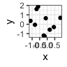

Preparing high-quality reports in R Markdown
================
Eugene Katsevich; July 12, 2022

Producing high-quality reports is essential to successfully
communicating the results of your statistical analyses. Below are
guidelines on producing high-quality reports, broken down by their
components: text, code, figures, and tables. Much of the code below is
based on the `tidyverse`:

``` r
library(tidyverse)
```

# Text

Your prose should be clear and concise. Use references to refer to
figures and tables.

# Code

Your code should be commented and easy to read. Make sure that your code
does not exceed the width of the page, like this:

``` r
# a line that exceeds the width of the page
tibble(x = 1:100, y = 5*x + rnorm(100, sd = 100)) %>% filter(x < 80) %>% summarise(sample_correlation = cor(x, y))
```

    ## # A tibble: 1 × 1
    ##   sample_correlation
    ##                <dbl>
    ## 1              0.734

To avoid such long lines of code, make sure your code does not reach the
vertical line in the right-hand side of your RStudio editor. Insert line
breaks appropriately to make your code more readable:

``` r
# appropriate line breaks added
tibble(x = 1:100, y = 5*x + rnorm(100, sd = 100)) %>%  # generate data
  filter(x < 80) %>%                                   # subset data
  summarise(sample_correlation = cor(x, y))            # evaluate sample corr.
```

    ## # A tibble: 1 × 1
    ##   sample_correlation
    ##                <dbl>
    ## 1              0.755

# Figures

Figures are very important tools to convey information to readers, and
they should be constructed thoughtfully. Please read [Chapter
28](https://r4ds.had.co.nz/graphics-for-communication.html) of R for
Data Science, which is a good reference for producing high-quality
figures. Here we discuss some of the most important elements.

## Sizing

The **aspect ratio** (i.e. ratio of width to height) of your plots is
consistent with their content; e.g. box plots are usually relatively
narrow, and scatter plots often make sense with equal aspect ratios.

The **absolute size** of your figures (specified in the chunk options
via the `fig.width` and `fig.height` arguments) should be such that the
the text on the plot is easy to read. Consider the following three
choices for the absolute sizes of the plot of the following test data:

``` r
test_data = tibble(x = rnorm(10), y = rnorm(10))
```

```` markdown
```{r test-plot-abs-small, echo = FALSE, fig.cap = "This plot's absolute 
size is too small.", fig.width=1, fig.height=1, out.width="40%", fig.align = "center"}
test_data %>% ggplot(aes(x = x, y = y)) + geom_point() + theme_bw()
```
````



```` markdown
```{r test-plot-abs-medium, echo = FALSE, fig.cap = "This plot's absolute 
size is about right.", fig.width=2, fig.height=2, out.width="40%", fig.align = "center"}
test_data %>% ggplot(aes(x = x, y = y)) + geom_point() + theme_bw()
```
````


```` markdown
```{r test-plot-abs-large, echo = FALSE, fig.cap = "This plot's absolute 
size is too large.", fig.width=5, fig.height=5, out.width="40%", fig.align = "center"}
test_data %>% ggplot(aes(x = x, y = y)) + geom_point() + theme_bw()
```
````


Among the three resulting figures, the small-sized plot is too cramped,
the large-sized plot has axis titles and labels that are too small to
read, and the medium-sized plot is about right. A good rule of thumb is
that the smallest text in your plots should be roughly the same size as
the text in your report.

The **relative size** of your figures (relative to the dimensions of
your report, as specified by `out.width` in the chunk header) should
also be chosen appropriately. Compare the following three figures
corresponding to relative sizes of 10%, 40%, and 80%. The small plot is
too small to see, the large plot takes up too much space, and the medium
one is about right.

```` markdown
```{r test-plot-rel-small, echo = FALSE, fig.cap = "This plot's relative 
size is too small.", fig.width=2, fig.height=2, out.width="10%", fig.align = 
"center"}
test_data %>% ggplot(aes(x = x, y = y)) + geom_point() + theme_bw()
```
````


```` markdown
```{r test-plot-rel-medium, echo = FALSE, fig.cap = "This plot's relative
size is about right.", fig.width=2, fig.height=2, out.width="40%", fig.align =
"center"}
test_data %>% ggplot(aes(x = x, y = y)) + geom_point() + theme_bw()
```
````


```` markdown
```{r test-plot-rel-large, echo = FALSE, fig.cap = "This plot's relative 
size is too large.", fig.width=2, fig.height=2, out.width="80%", fig.align =
"center"}
test_data %>% ggplot(aes(x = x, y = y)) + geom_point() + theme_bw()
```
````


## Titles

Each plot should include informative axis and legend titles. For
example, consider the code below (drawn from R4DS Chapter 28), which
produces the above plot.

``` r
# a plot without clear axis and legend titles
mpg %>%
  ggplot(aes(x = displ, y = hwy)) +
  geom_point(aes(color = class)) +
  geom_smooth(se = FALSE) + 
  theme_bw()
```


This is a plot of fuel efficiency versus engine displacement for various
types of cars, but the axis and legend labels on the plot do not make
this very clear.

We can easily add informative titles to this plot using `labs`, which is
much easier to understand.

``` r
# a plot with clear axis and legend titles
mpg %>%
  ggplot(aes(x = displ, y = hwy)) +
  geom_point(aes(color = class)) +
  geom_smooth(se = FALSE) + 
  labs(
    x = "Engine displacement (liters)",
    y = "Highway fuel economy (miles per gallon)",
    colour = "Car type"
  ) +
  theme_bw()
```


Plots might or might not need overall titles; often the axis titles
speak for themselves and the message of the plot can be conveyed in the
caption) To add plot titles if necessary, use `ggtitle`. If applicable,
axis titles should also include the units of measurement, e.g. liters or
miles per gallon.

## Layout

Sometimes, two or more plots make sense to present together in a single
figure. This can be accomplished in two ways. If the different plots
convey the same type of information but for different slices of the
data, then `facet_grid` and `facet_wrap` are the best way of laying out
these plots. For example, the code and figure below illustrate
`facet_wrap` for the `mpg` data used above.

``` r
# illustrate how to use facet_wrap to create a multi-panel plot
mpg %>%
  filter(class %in% 
           c("2seater", "compact", "midsize")) %>%  # select 3 classes of cars
  ggplot(aes(x = displ, y = hwy)) +
  geom_point() +
  facet_wrap(class ~ .) +                           # separate panels per class
  labs(
    x = "Engine displacement (liters)",
    y = "Highway fuel economy\n(miles per gallon)", # line break in axis title
  ) +
  theme_bw()
```


If the plots convey different types of information, then they should be
created separately and then concatenated together using the `plot_grid`
function from the `cowplot` package.

``` r
library(cowplot)
```

An example is shown below.

``` r
# illustration of using cowplot to concatenate multiple plots

# first plot: box plot of fuel economy by car type
p1 = mpg %>%
  mutate(class =                         # re-order car classes by fuel economy
           fct_reorder(class, hwy)) %>%
  ggplot(aes(x = class, y = hwy, fill = class)) +
  geom_boxplot() +
  labs(
    x = "Car type",
    y = "Highway fuel economy\n(miles per gallon)"
  ) + 
  theme_bw() + 
  theme(legend.position = "none",        # remove legend and x axis text because 
        axis.text.x = element_blank())   #  information present in second plot

# second plot: scatter plot of fuel economy versus car type
p2 = mpg %>%
  mutate(class =                         # re-order car classes by fuel economy
           fct_reorder(class, hwy)) %>%
  ggplot(aes(x = displ, y = hwy)) +
  geom_point(aes(color = class)) +
  geom_smooth(se = FALSE) + 
  labs(
    x = "Engine displacement (liters)",
    colour = "Car type"
  ) +
  theme_bw() + 
  theme(axis.title.y = element_blank())  # remove y axis title because already
                                         #  present in the first plot

# use cowplot to concatenate the two plots
plot_grid(p1, p2, 
          rel_widths = c(1,2), # specify relative widths
          align = "h")         # how to align subplots
```


# Tables

Tables are generally less complex than figures, but many of the
principles of creating high-quality figures carry over to tables as well
(e.g. choosing appropriate sizes, captions, and titles.)

## Formatting

Use `kable` from the `knitr` package, in conjunction with the
`kableExtra` package, for creating nice tables. An example is below.

``` r
library(kableExtra)
```

## Column titles for tables

Just like axis labels for figures, column titles for tables should be
easily readable. Often this means not using the variable names directly
from your data frame. For example, consider the table below, which
displays the number of cylinders and the drive train type for the cars
in `mpg`.

``` r
# a table without clear column titles
mpg %>% 
  count(cyl, drv) %>%
  kable(row.names = NA, 
      booktabs = TRUE, digits = 2) %>%
  kable_styling(position = "center")
```

<table class="table" style="margin-left: auto; margin-right: auto;">
<thead>
<tr>
<th style="text-align:right;">
cyl
</th>
<th style="text-align:left;">
drv
</th>
<th style="text-align:right;">
n
</th>
</tr>
</thead>
<tbody>
<tr>
<td style="text-align:right;">
4
</td>
<td style="text-align:left;">
4
</td>
<td style="text-align:right;">
23
</td>
</tr>
<tr>
<td style="text-align:right;">
4
</td>
<td style="text-align:left;">
f
</td>
<td style="text-align:right;">
58
</td>
</tr>
<tr>
<td style="text-align:right;">
5
</td>
<td style="text-align:left;">
f
</td>
<td style="text-align:right;">
4
</td>
</tr>
<tr>
<td style="text-align:right;">
6
</td>
<td style="text-align:left;">
4
</td>
<td style="text-align:right;">
32
</td>
</tr>
<tr>
<td style="text-align:right;">
6
</td>
<td style="text-align:left;">
f
</td>
<td style="text-align:right;">
43
</td>
</tr>
<tr>
<td style="text-align:right;">
6
</td>
<td style="text-align:left;">
r
</td>
<td style="text-align:right;">
4
</td>
</tr>
<tr>
<td style="text-align:right;">
8
</td>
<td style="text-align:left;">
4
</td>
<td style="text-align:right;">
48
</td>
</tr>
<tr>
<td style="text-align:right;">
8
</td>
<td style="text-align:left;">
f
</td>
<td style="text-align:right;">
1
</td>
</tr>
<tr>
<td style="text-align:right;">
8
</td>
<td style="text-align:left;">
r
</td>
<td style="text-align:right;">
21
</td>
</tr>
</tbody>
</table>

We can specify clear column names via the `col.names` argument to
`kable`. See table below and the code chunk that produced it.

``` r
# a table with clear column titles
mpg %>% 
  count(cyl, drv) %>%
  kable(row.names = NA, 
        col.names = c("Num. cylinders", "Drive train", "Count"),
        booktabs = TRUE, 
        digits = 2) %>%
  kable_styling(position = "center")
```

<table class="table" style="margin-left: auto; margin-right: auto;">
<thead>
<tr>
<th style="text-align:right;">
Num. cylinders
</th>
<th style="text-align:left;">
Drive train
</th>
<th style="text-align:right;">
Count
</th>
</tr>
</thead>
<tbody>
<tr>
<td style="text-align:right;">
4
</td>
<td style="text-align:left;">
4
</td>
<td style="text-align:right;">
23
</td>
</tr>
<tr>
<td style="text-align:right;">
4
</td>
<td style="text-align:left;">
f
</td>
<td style="text-align:right;">
58
</td>
</tr>
<tr>
<td style="text-align:right;">
5
</td>
<td style="text-align:left;">
f
</td>
<td style="text-align:right;">
4
</td>
</tr>
<tr>
<td style="text-align:right;">
6
</td>
<td style="text-align:left;">
4
</td>
<td style="text-align:right;">
32
</td>
</tr>
<tr>
<td style="text-align:right;">
6
</td>
<td style="text-align:left;">
f
</td>
<td style="text-align:right;">
43
</td>
</tr>
<tr>
<td style="text-align:right;">
6
</td>
<td style="text-align:left;">
r
</td>
<td style="text-align:right;">
4
</td>
</tr>
<tr>
<td style="text-align:right;">
8
</td>
<td style="text-align:left;">
4
</td>
<td style="text-align:right;">
48
</td>
</tr>
<tr>
<td style="text-align:right;">
8
</td>
<td style="text-align:left;">
f
</td>
<td style="text-align:right;">
1
</td>
</tr>
<tr>
<td style="text-align:right;">
8
</td>
<td style="text-align:left;">
r
</td>
<td style="text-align:right;">
21
</td>
</tr>
</tbody>
</table>
